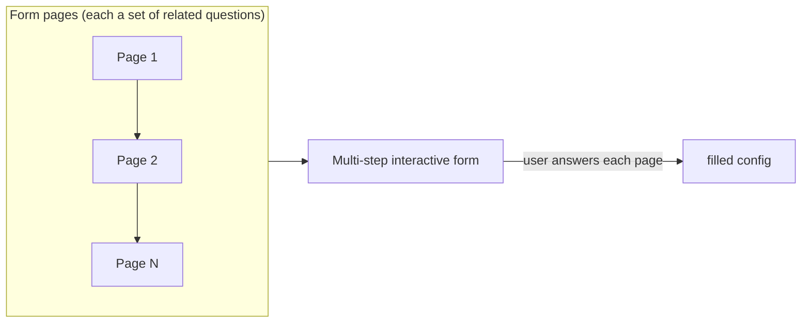
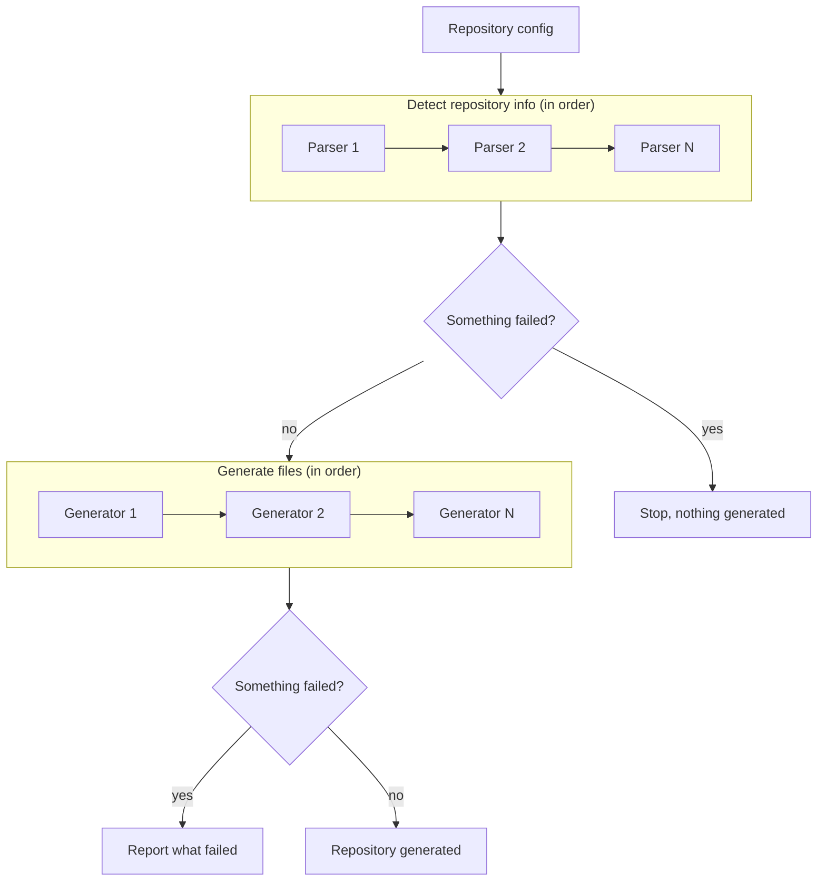

# engine <!-- omit in toc -->

<div align="center">
  
  
  
  
  
</div>

---

- [How to use ?](#how-to-use-)
- [Initialize (pkg.go.dev)](#initialize-pkggodev)
  - [Reference](#reference)
- [Generate (pkg.go.dev)](#generate-pkggodev)
  - [Reference](#reference-1)
  - [Constants](#constants)
- [Helpers](#helpers)
  - [Files (pkg.go.dev)](#files-pkggodev)
  - [Generators (pkg.go.dev)](#generators-pkggodev)
  - [Parsers (pkg.go.dev)](#parsers-pkggodev)

A Go library to build projects scaffolding CLIs on three main features:
- [**Initialization**](#initialize-pkggodev): interactive user configuration with [**huh**](https://github.com/charmbracelet/huh) (*e.g.* license choice, maintainers list, etc.)
- [**Parsing**](#parsers-pkggodev): repository languages parsing
- [**Generation**](#generate-pkggodev): repository scaffolding with files generation based on Go template

## How to use ?

```sh
go get -u github.com/kickr-dev/engine@latest
```

## Initialize ([pkg.go.dev](https://pkg.go.dev/github.com/kickr-dev/engine/pkg))

Runs an interactive form with [**huh**](https://github.com/charmbracelet/huh)
and alters the created configuration gradually with each `huh.Group`.



**Examples**: see the package documentation.

### Reference

- `Initialize`: runs the interactive form and returns the filled configuration
- `WithFormGroups`: ordered list of **huh** groups to gradually fill the created configuration
- `WithTeaOptions`: options to tune the TUI (Terminal User Interface), native [**bubbletea**](github.com/charmbracelet/bubbletea) options, underlying framework of **huh**
- `ErrRequiredField`: specific error to return during groups validation to force user input

## Generate ([pkg.go.dev](https://pkg.go.dev/github.com/kickr-dev/engine/pkg))

Parses a repository with all its configured parsers
and then run all generators to create the appropriate files regarding the repository configuration, technologies, languages, etc.



**Examples**: see the package documentation.

### Reference

- `Generate`: runs all given parsers then all given generators against a repository
- `Configure`: applies `OptionFunc` options (`WithLogger`, `WithForce`, `WithFuncMap`) globally before calling `Generate`
- `ApplyTemplate`: applies a single `Template` (used internally by `GeneratorTemplates` / `GeneratorModules`)
- `ApplyPatches`: applies a `Template`'s `Patches` on an already generated file
- `ExecuteTemplate`: executes a parsed Go template and writes it to `out`, honoring the given `EmptyPolicy`
- `FuncMap`: returns the default `template.FuncMap` used during Go templating
- `ToSlug`: slugifies an input string
- `GlobsWithPart`: builds glob patterns for a template name, including its `.part` subparts
- `DelimitersChevron` / `DelimitersBracket` / `DelimitersSquareBracket`: predefined `Delimiters` for Go templates
- `NewLoggerURL`: wraps an `http.RoundTripper` to log request URLs via the configured `Logger`
- `NewTestLogger`: creates a `Logger` writing to an `io.Writer`, intended for tests only
- `WithLogger`: provides a custom `Logger` implementation
- `WithForce`: forces generation of all defined `Template` (useful when projects removed the generated notice)
- `WithFuncMap`: enriches default `template.FuncMap` provided during Go templating
- `GetLogger`: gets configured `logger` option at any point in the workflow
- `Forced`: gets configured `force` option at any point in the worflow
- `ShouldGenerate`: returns whether a file should be generated according to its `GeneratePolicy` (existence, emptiness, generated notice, `PolicyAlways`, `Forced`)
- `IsEmpty`: returns whether a given content is considered empty according to an `EmptyPolicy`
- `GeneratorTemplates`: returns a `Generator` taking a slice of `Template` to generate from the base of the repository (real path depends on each template `Out` attribute)
- `GeneratorModules`: returns a `Generator` taking a slice of `Template` to generate from the base of each `Module` (real path depends on each template `Out` attribute).
  A module is a directory of a given repository, useful to handle files generation in monorepositories

### Constants

- `PartExtension` (`.part`): extension for template subparts, expected to be used with `TmplExtension`
- `PatchExtension` (`.patch`): extension for template file patches
- `PolicyAlways` / `PolicyNone`: `GeneratePolicy` values controlling whether a file is always generated or only per default behavior (default `PolicyNone`)
- `PolicyKeep` / `PolicyRemove`: `EmptyPolicy` values controlling whether an empty generated file is kept or removed (default `PolicyRemove`)
- `TmplExtension` (`.tmpl`): extension for template files

## Helpers

To avoid rewriting from scratch generic functions, the library also exposes helpers packages
[`pkg/files`](#files-pkggodev), [`pkg/generator`](#generators-pkggodev) and [`pkg/parser`](#parsers-pkggodev),
including non-exhaustively `go.mod`, `go.work`, `package.json` parsing, license and gitignore contents download.

### Files ([pkg.go.dev](https://pkg.go.dev/github.com/kickr-dev/engine/pkg/files))

Read, write, validate and locate files across a directory tree.

**Examples**: see the package documentation.

#### Reference

- `ReadJSON` / `WriteJSON`: reads/writes a JSON file into/from a Go value
- `ReadYAML` / `WriteYAML`: reads/writes a YAML file into/from a Go value
- `ReadTOML` / `WriteTOML`: reads/writes a TOML file into/from a Go value
- `ReadJSONFunc` / `ReadYAMLFunc` / `ReadTOMLFunc`: wraps the matching `Read` function into the `func(out any) error` signature `Validate` expects
- `Validate`: validates a file format against a JSON schema, returning `ValidationError` on failure
- `ErrNilRead`: returned by `Validate` when a nil read function is provided
- `Exists`: checks whether a provided path exists
- `Glob`: walks a directory tree to find specific files per glob
- `GlobExcludedDirectories`: excludes specific directories from glob matching
- `GlobExcludedFiles`: excludes specific files from glob matching
- `Umask`: returns the running process' umask, computed once for the process' lifetime

#### Constants

- `Rw` (`0o600`), `RwRR` (`0o644`), `RwRwRw` (`0o666`), `RwxRxRxRx` (`0o755`): file-mode constants

### Generators ([pkg.go.dev](https://pkg.go.dev/github.com/kickr-dev/engine/pkg/generator))

Fetches and downloads scaffolding content from external sources.

**Examples**: see the package documentation.

#### Reference

- `FetchGitignore`: fetches a `.gitignore` from [**Toptal**](https://www.toptal.com/developers/gitignore)
- `FetchCodeOfConduct`: fetches the [**Contributor Covenant 3.0**](https://www.contributor-covenant.org/version/3/0/code_of_conduct/) markdown

#### Constants

- `CodeOfConductURL`: Contributor Covenant 3.0 markdown source used by `FetchCodeOfConduct`
- `ErrNoClient`, `ErrInvalidResponse`, `ErrNoTemplates`: errors returned on invalid client, HTTP response or missing templates
- `FileCodeOfConduct` (`CODE_OF_CONDUCT.md`): default code of conduct output filename
- `FileGitignore` (`.gitignore`): default gitignore output filename
- `GitignoreBaseURL`: Base URL to fetch Gitignores from

### Parsers ([pkg.go.dev](https://pkg.go.dev/github.com/kickr-dev/engine/pkg/parser))

Detects and parses a repository's languages, tooling and configuration files.

**Examples**: see the package documentation.

#### Reference

- `Git`: detects a Git repository by parsing its configuration (remote, platform, host, repository path, repository name and tags), returning a `VCS` struct
- `ReadGomod`: detects a Golang repository by parsing its `go.mod`, returning a `Gomod` struct
- `ReadGowork`: detects a Golang repository by parsing its `go.work` and all its `uses` `go.mod`
- `ReadHugo`: detects a Hugo site by parsing its `hugo.*` configurations
- `MergeValues`: merges multiple `yaml` files together into the input `values`
- `PackageJSON.Validate`: validates a `package.json` (package manager requirement)
- `ReadGoCmd`: detects Go executables (CLIs, crons, jobs, workers) under a `cmd` folder
- `Gomod.AsVCS`: converts a parsed `Gomod` into a `VCS`
- `Gowork.Module`: returns the workspace's module path
- `Executables.AddCLI` / `AddCron` / `AddJob` / `AddWorker`: registers a detected executable by kind
- `Executables.Binaries`: returns the total count of registered executables

#### Constants

- `Bitbucket`, `Gitea`, `GitHub`, `GitLab`: recognized VCS platform identifiers
- `ErrMissingModuleStatement`, `ErrMissingGoStatement`: errors returned on invalid `go.mod`/`go.work` files
- `ErrMissingPackageName`, `ErrInvalidPackageManager`: errors returned on invalid `package.json` files
- `ErrNoGowork`: returned by `ReadGowork` when no `go.work` file is found
- `ErrNoHugo`: returned by `ReadHugo` when no Hugo configuration is found
- `FileGomod` (`go.mod`): Go module file name
- `FileGowork` (`go.work`): Go workspace file name
- `FileMain` (`main.go`): Go main file name
- `FilePackageJSON` (`package.json`): npm package manifest file name
- `FolderCMD` (`cmd`): conventional Go commands folder name
